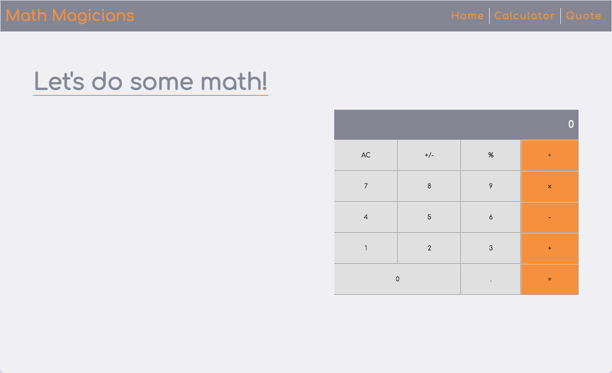

# Math Magicians

"Math Magicians" is a single page application (SPA) built with React for people who love mathematics. It helps to make calculations straight forward and easy"



## live Demo [click here](https://kaylemba.github.io/math-magicians2/)


> This is a calculator application that solves advanced problems in Physics and Mathematics.


## Built With

- ReactJS
- Css


## Getting Started

To get a local copy up and running follow these simple example steps.

### Setup

```bash
git clone git@github.com:KayLemba/math-magicians2.git
cd ./math-magicians2
```

### Install

```bash
npm install
```

### To Run it

```bash
npm start
```

### Build

```bash
npm run build
```
## Author
👤 **Kalolo Chola Lemba**
- GitHub: [@KayLemba](https://github.com/KayLemba)
- Twitter: [@King-Kaylo1](https://twitter.com/King_Kaylo1) 
- LinkedIn: [@kalolo-lemba](https://www.linkedin.com/in/https://www.linkedin.com/in/kalolo-lemba-41a8339a/-41a8339a/)

## 🤝 Contributing

Contributions, issues, and feature requests are welcome!

## Show your support

Give a ⭐️ if you like this project! ❤️ ❤️ ❤️ 

## Acknowledgments

- Microverse

## 📝 License

This project is [MIT](./MIT.md) licensed.